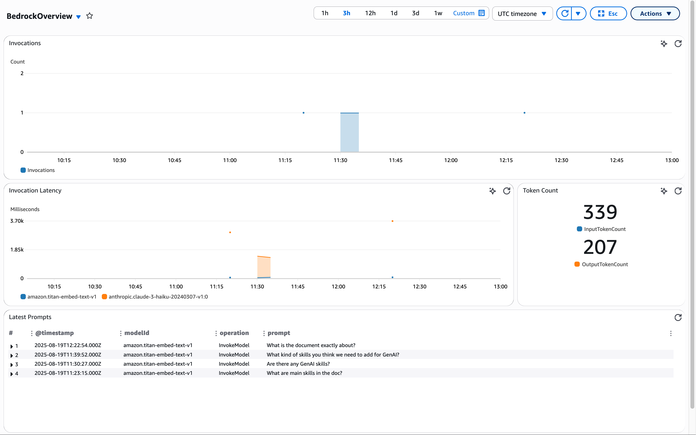

# Condense

A serverless document summarization and chat application built on AWS, featuring AI-powered document processing, real-time chat, and intelligent search capabilities.

## 🏗️ Architecture

Condense is built using a modern serverless architecture with three main components:

- **Frontend** (`amplify/`) - React TypeScript web application
- **Infrastructure** (`infrastructure/`) - Terraform AWS infrastructure as code
- **Backend** (`lambda/`) - TypeScript Lambda functions for processing and APIs

## ✨ Features

- **Document Upload & Processing** - Upload PDFs and documents for AI-powered summarization
- **Real-time Chat** - WebSocket-based chat interface for document Q&A
- **Vector Search** - Semantic search using Amazon Bedrock embeddings
- **User Profiles** - Personalized user experience with profile management
- **Serverless Architecture** - Fully serverless with automatic scaling

## 🚀 Quick Start

### Prerequisites

- AWS CLI configured with appropriate permissions
- Terraform >= 1.0
- Node.js >= 18
- GitHub account (for Amplify deployment)

### 1. Clone and Setup

```bash
git clone <your-repo-url>
cd condense
```

### 2. Deploy Infrastructure

```bash
cd infrastructure
cp terraform.tfvars.example terraform.tfvars
# Edit terraform.tfvars with your configuration
terraform init
terraform plan
terraform apply
```

### 3. Build and Deploy Lambda Functions

```bash
cd ../lambda
npm install
npm run build:all
```

### 4. Deploy Frontend

The frontend is automatically deployed via AWS Amplify when you push to your configured branch.

## 📁 Project Structure

```
condense/
├── amplify/                 # React frontend application
│   ├── src/
│   │   ├── components/      # React components
│   │   ├── pages/          # Application pages
│   │   ├── services/       # API service layer
│   │   └── types/          # TypeScript type definitions
│   └── package.json
├── infrastructure/          # Terraform infrastructure
│   ├── modules/            # Terraform modules
│   │   ├── api/           # API Gateway & Lambda integrations
│   │   ├── auth/          # Cognito authentication
│   │   ├── chat/          # WebSocket chat infrastructure
│   │   ├── processing/    # Document processing pipeline
│   │   ├── search/        # OpenSearch cluster
│   │   └── storage/       # S3 buckets and DynamoDB tables
│   └── main.tf
└── lambda/                 # Backend Lambda functions
    ├── src/
    │   ├── chat-*/        # WebSocket chat handlers
    │   ├── *-handler/     # API endpoint handlers
    │   ├── processing/    # Document processing functions
    │   └── shared/        # Shared utilities and types
    └── package.json
```

## 🔧 Configuration

### Infrastructure Configuration

Edit `infrastructure/terraform.tfvars`:

```hcl
aws_region   = "us-west-2"
project_name = "condense"
environment  = "dev"

repository_url      = "https://github.com/YOUR_USERNAME/YOUR_REPO"
github_access_token = "ghp_your_token_here"
branch_name        = "main"

opensearch_instance_type = "t3.small.search"
lambda_memory_size      = 1024
```

### Frontend Configuration

Edit `amplify/.env`:

```env
REACT_APP_API_URL=https://your-api-gateway-url
REACT_APP_WEBSOCKET_URL=wss://your-websocket-url
REACT_APP_USER_POOL_ID=your-cognito-pool-id
REACT_APP_USER_POOL_CLIENT_ID=your-cognito-client-id
```

## 🛠️ Development

### Local Development

1. **Frontend Development**:
```bash
cd amplify
npm install
npm start
```

2. **Lambda Development**:
```bash
cd lambda
npm install
npm run build
```

3. **Infrastructure Changes**:
```bash
cd infrastructure
terraform plan
terraform apply
```

### Building Lambda Functions

```bash
cd lambda
npm run build:all          # Build and package all functions
npm run package:api        # Package only API functions
npm run package:processing # Package only processing functions
npm run package:chat       # Package only chat functions
```

## 🏛️ AWS Services Used

- **API Gateway** - REST API and WebSocket endpoints
- **Lambda** - Serverless compute for all backend logic
- **DynamoDB** - Document metadata and chat history storage
- **S3** - Document and vector storage
- **Bedrock** - AI models for embeddings and summarization
- **Cognito** - User authentication and authorization
- **SQS** - Asynchronous document processing queue
- **Step Functions** - Document processing orchestration
- **Amplify** - Frontend hosting and CI/CD

## 📊 API Endpoints

### Document Management
- `POST /documents` - Upload document
- `GET /documents` - List user documents
- `GET /documents/{id}` - Get document details
- `DELETE /documents/{id}` - Delete document
- `GET /documents/{id}/status` - Get processing status

### Chat
- `GET /chat/history/{id}` - Get chat history
- WebSocket: `wss://your-websocket-url` - Real-time chat

### User Management
- `GET /profile` - Get user profile
- `POST /profile` - Create user profile
- `PUT /profile` - Update user profile

## 🔒 Security

- **Authentication** - AWS Cognito User Pools
- **Authorization** - JWT tokens with API Gateway authorizers
- **CORS** - Configured for secure cross-origin requests
- **Encryption** - Data encrypted at rest and in transit

## 📈 Monitoring

### 🤖 Bedrock Model Invocation Logging

Condense includes comprehensive logging for all Amazon Bedrock model invocations to provide visibility into AI model usage, performance, and costs.

#### Infrastructure
The logging infrastructure is automatically deployed via Terraform and includes:
- CloudWatch Log Group: `/aws/bedrock/modelinvocations`
- IAM Role for Bedrock logging permissions
- Model invocation logging configuration with text, embedding, and image data delivery

#### Querying Logs with CloudWatch Logs Insights

Use this query to analyze chat interactions and model usage:

```sql
fields @timestamp, @message
| parse @message /"operation":"(?<operation>[^"]*)"/
| parse @message /"modelId":"(?<modelId>[^"]*)"/
| parse @message /"inputText":"(?<prompt>[^"]*)"/
| filter ispresent(operation) and ispresent(prompt) and @message like /condense-dev-chat-message/
| sort @timestamp desc
```

This query extracts:
- **operation** - The Bedrock operation (InvokeModel, etc.)
- **modelId** - Which AI model was used (Claude, Titan, etc.)
- **prompt** - The actual user question or input text
- Filters to show only chat-related model invocations

#### Dashboard Screenshot



*CloudWatch Dashboard showing the number of invocations over time by model, invocation latency by model, token count by input & output, and latest prompts from model invocation logs.*

In dashboard above we are showing the following information:

- The number of invocations over time by model
- Invocation latency by model
- Token count by input and output tokens
- The latest prompts from the invocation logs showing the model, operation, input and output token count

## 🚀 Deployment

### Production Deployment

1. Update `terraform.tfvars` for production settings
2. Deploy infrastructure: `terraform apply`
3. Lambda functions are automatically deployed via Terraform
4. Frontend deploys automatically via Amplify on git push

### Environment Management

The infrastructure supports multiple environments through Terraform workspaces:

```bash
terraform workspace new production
terraform workspace select production
terraform apply -var-file="production.tfvars"
```